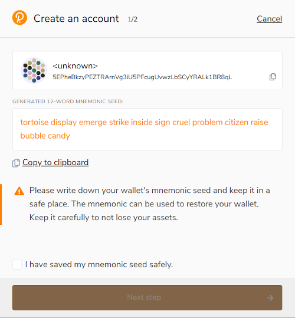
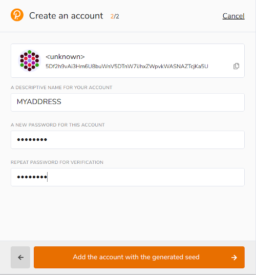
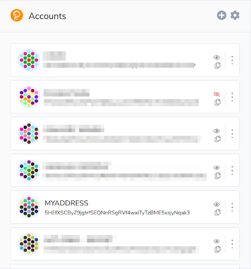

# Creating Substrate Address

Unique Network, like most blockchains, is based on [accounts or addresses](/concepts/addresses/index.md). An address can own some QTZ or UNQ tokens, NFTs or some ERC-20 tokens. It can sign transactions to transfer these valuable assets to other addresses or to make some actions in Decentralized Apps (dApps). For example, an address can buy and sell NFTs on the NFT Marketplace.

A typical Quartz address looks like this: `yGHuU9CWnrHMUz8GJRmpA9MowmtMKZvnq2tLc5mk3zMFizW5X`

So, to purchase and sell tokens on the Market, you need to have a Unique Network account. To create a new account, you should get an address that can own NFTs and allow you to manage KSM. The best way to get an address is to install the **Polkadot{.js} browser extension** [for Chrome](https://chrome.google.com/webstore/detail/polkadot%7Bjs%7D-extension/mopnmbcafieddcagagdcbnhejhlodfdd) or [for Firefox](https://addons.mozilla.org/en-US/firefox/addon/polkadot-js-extension/). This browser extension manages accounts and allows you to sign transactions with these accounts.

To create a Unique Network account:
1. Download the [Polkadot{.js} extension](https://polkadot.js.org/extension/) and add it to your browser.
2. Click on the Polkadot{.js} extension in your browser.
3. In the **Authorize** window, read the disclaimer and click **Yes, allow this application access**.
4. Click the **Add Account** icon (**+**) and then click **Create new account**. This will generate your wallet address and the 12-word mnemonic seed – the series of words that can be used to restore your wallet. :warning: Copy this seed and keep it a safe place. :warning:
 
5. Select "I have saved my mnemonic seed safely" and click **Next step**.
6. On the next screen, in the _NETWORK_ drop-down menu, select **Allow use on any chain**. Add a name for your account and create a new password by entering the password twice.
 
7. Click **Add the account with the generated seed**. Your newly created account is now displayed in the Accounts window.               
   

Each account has an icon displayed next to the account name. Clicking this icon, you copy the account address to the clipboard.
