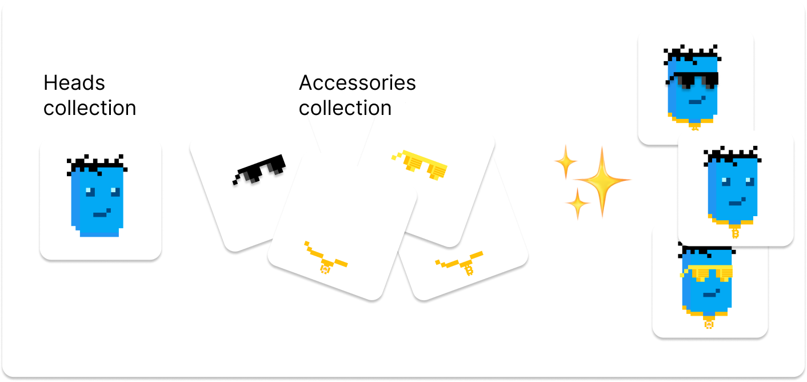
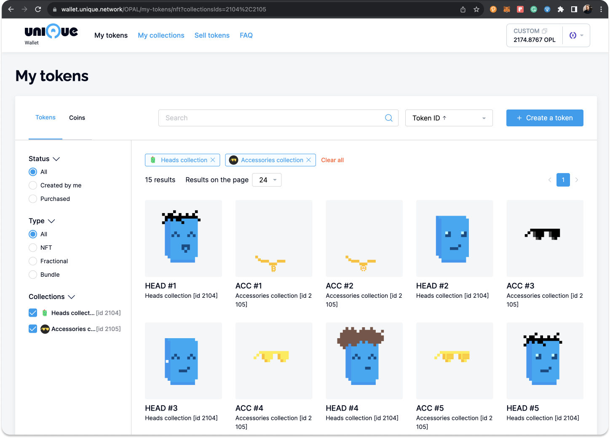
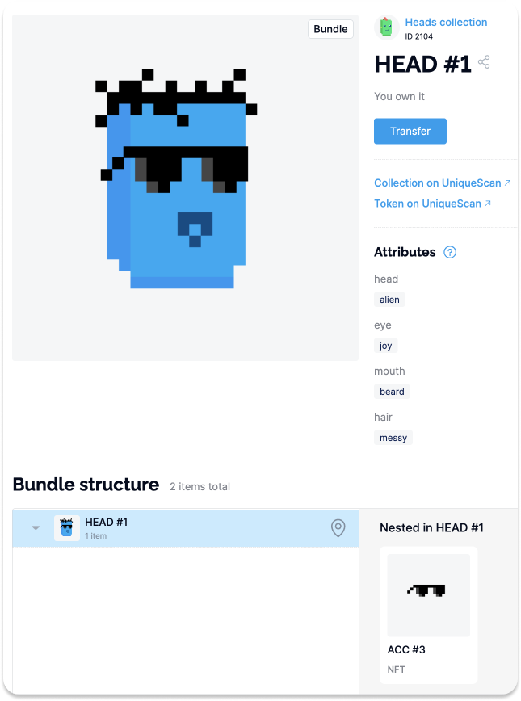

# Customizable NFTs guide

Customizable NFTs provide a unique approach where users can visually modify the appearance of their NFTs. This modification happens by nesting one NFT within another and establishing an on-chain relationship between them. This entire customization process is a combination of on-chain and off-chain operations.

Key Concepts:

**Nesting**: refers to the process where one NFT "owns" or holds another NFT, leading to a tree-like structure. For more details on nesting, click here.

**Off-chain Service**: This service reads data from the blockchain and then modifies the properties or image of the token based on that data.

In this tutorial, we will create two collections:

**Base Collection** of [square heads](https://uniquescan.io/opal/collections/2104) tokens of this collection will be customized.

**Accessory Collection**: When these [accessories](https://uniquescan.io/opal/collections/2105) are nested into the base collection, the image of the token will change, making it look as if the square head is wearing the accessory.

Now, let's get started with the implementation.



## 🏁 1. Before we start

1. For this tutorial, you will need node.js, git, and Visual Studio Code installed on your computer. If you haven't worked with git, node, and npm before, we recommend reading our [brief guide](./setup-environment) to configure your environment correctly.
2. Prepare minting scripts according to [this instruction](./prepare-scripts.md)

### 1.1 Prepare images and metadata

Creating a customizable NFT collection doesn't deviate much from creating standard collections. In this guide, we'll walk you through all the steps, but we won't delve deep into the details of each. If anything seems unclear, you can refer back to the specific sections on [mass minting](./mass-minting.md) and [generative NFTs](./generative-nft.md) for more detailed explanations.

We've already generated a **heads** collection and an **accessories** collection for this tutorial. You can locate them in the `customization` folder.

### 1.2 If you are ready to create your own collection

The process for preparing metadata images is detailed in guides on [mass minting](./mass-minting.md) and [generative NFTs](./generative-nft.md).

Complete all the steps up to and including the `Describe NFT attributes` stage.

> ⚠️ Do not proceed with the steps for creating a collection and tokens; we will need additional configuration!

For creating a head collection, we followed the generative NFT guide.
We utilized the mass minting guide to make an attributes collection, substituting cosmic animal images with accessory images.

#### What to Consider When Preparing Your Images

When nesting, the accessories NFT will overlay onto the base NFT. To ensure correct alignment and overlay, keep the following in mind:

- Base collection and accessories images should have the same height and width.
- The position of accessories should be calibrated relative to the base image.
- Accessory images should have a transparent background – use the .png format.
- Accessory images should not overlap with each other.


## 🧸 3. Creating the Base Collection

### 3.1 Prepare Collection Images and Metadata

NFTs from the base collection will own the NFTs from the accessories collection. This ownership will be achieved through nesting, and an external service will merge the accessory image with the base token. We've already prepared a set of images and their metadata for this guide as per the generative NFT instructions. You can find them in the `customization/heads` folder.

Delete the `data` folder's contents and copy the contents from `customization/heads` into it. Alternatively, prepare your images and metadata following the mass-minting or generative NFT instructions.

### 3.2 Prepare the Configuration File

If you haven't yet created a config.js file in the project root, do so now and copy the contents of config.example.js.

Make sure the following fields are filled:

- ownerSeed - find out [how to generate an address and obtain tokens](./prepare-account.md).
- name - the name of the upcoming collection.
- description - a brief about the collection.
- symbol - ensure that image names match the format {symbol}{id}.png. For instance, we set the symbol to `HEAD` for the base collection of heads, and the images are named head1.png, head2.png, and so on.
- Set the nesting permissions as you wish. If you want it to be available to the token owner, set `nesting.tokenOwner: true`. If you want to give this ability to the collection admin, set `nesting.collectionAdmin: true`.
- The head collection will be the base, and its image will change when nesting accessories. To enable this, set the property `customizableUrl: true`.

<details>
  <summary style="color:#0095D4; cursor:pointer;">How does the customization URL actually work? 🤔</summary>

External services, such as a wallet or marketplace, retrieve the token's image link from the `image` property stored on-chain. In its simplest form, this is a direct link to IPFS.

The `image` property stores a link to an off-chain service that modifies images for customizable collections. In our case, it's https://nesting.unique.network. This service searches for nested tokens and merges the images. Meanwhile, the link to the original image is stored on-chain in the `file` property.
</details>

At this stage, your config.js file should resemble `customization/heads/config.example.js`.

<details>
  <summary style="color:#0095D4; cursor:pointer;">Check your config file looks like...</summary>

  ```js
  const config = {
    endpoint: 'https://rest.unique.network/opal/v1',
    // Set your secret mnemonic phrase. Keep it safe!
    ownerSeed: 'set your seed...',
    
    // Set desired collection attributes
    collection: {
        collectionId: '', // you will get the collection id after the step 2-create-collection.js
        fileUrl: '', // link to IPFS, you will get it after the step 1-upload-images.js
        
        name: 'Heads collection',
        description: 'This collection demonstrates how to create customizable NFTs',
        // It is required that all NFT image names begin with the symbol, e.g. sa1.png, sa2.png ...
        symbol: 'HEAD',

        customizableUrl: true, // set true only for the base customizable collection
        
        // To enable nesting set these properties:
        nesting: {
            tokenOwner: true,
            collectionAdmin: true,    
        }
    },

    // Extra configuration

    desiredCount: 30, // How many NFTs to generate. Used only for 0-generate-nfts.js
    coverFileName: 'cover.png', // Your cover should have this name. Save it in ./data folder
    numberOfTokensGeneratedAtOnce: 25,
    dataDir: './data',
    tokensCSV: 'nfts.csv',
    generationDir: './generate',
    attributesCsv: 'attributes.csv',
    nestingUrl: 'https://nesting.unique.network/common',
    imagesInParallel: require('os').cpus().length,
}

module.exports = config;

  ```

</details>


## 💎 4. Mint base collection and NFTs

### 4.1 Upload images to IPFS

In simple terms, the Inter-Planetary File System (IPFS) is a distributed file storage protocol that enables a network of computers to store any data in a reliable and unchangeable manner.

```sh:no-line-numbers
node 1-upload-images.js
```

After a short time, you will see the result of executing the command:


This script will pack all the images into a zip archive and save it as `data/archive.zip`. Then, it will upload it to IPFS. Ensure all your files are successfully uploaded by visiting the link provided in the console output.

> ✏️ In the `config.js` file, fill in the `fileUrl` set provided link. 

### 4.2 Create a collection

We have set the collection metadata in the previous steps. Double-check that the name, description, and symbol fields are filled in `config.js`. Afterward, execute the script.

```sh:no-line-numbers
node 2-create-collection.js
```

After a short time, you will see the result of executing the command:

```
🚀 Creating collection... done!
❗️❗️❗️ add to "config.js" collectionId: 2015
```

> ✏️ In the `config.js` file, fill in the `collectionId` set provided value.

Your collection has been created, and you can check it on your [wallet](https://wallet.unique.network/) or on [uniquescan.io](https://uniquescan.io/). Your collection has no NFTs yet, so let's create some.


### 4.3 Create NFTs

We have set the token metadata in the previous steps in the nfts.csv file. Check again if it exists. After that, execute the following script.

```sh:no-line-numbers
node 3-create-nfts.js
```

After a short time, you will see the result of executing the command:

```
🚚 successfully created 1 part of NFT's
🚀 Creating NFTs... done!
Token Ids: 1, 2, 3, 4, 5

🔗 You can find your collection and tokens here: https://uniquescan.io/opal/collections/2015
```

Your base collection and tokens have been successfully created! You can find it in your [wallet](https://wallet.unique.network/). Make sure that your tokens are successfully displayed in the wallet or on the scan. 

## 👕 5. Creating the Accessories Collection

We've already prepared a set of images and their corresponding metadata following the instructions for mass-minting NFTs. You can find them in the `customization/accessories` folder.

Delete the `data` folder's contents and copy the contents from `customization/accessories` into it. Alternatively, prepare your own images and metadata following the instructions for mass minting or generative NFTs.

### 5.1 Prepare the Configuration File

Make the following adjustments to the config.js file:

- name - Set the name for the accessories collection.
- description - Provide a new description
- symbol - Ensure that the image names follow the `{symbol}{id}.png` format. For provided images, the symbol should be `ACC`.
- Do not change the values for nesting permissions (`nesting.tokenOwner`, `nesting.collectionAdmin`) set during the creation of the base collection. Adjust the nesting permissions according to your preference.
- The properties `fileUrl` and `collectionId` should be left empty.
- Set the `customizableUrl` property to false, as the dynamic image is only required for tokens of the base collection.

At this stage, your `config.js` file should remind `customization/accessories/config.example.js`

<details>
  <summary style="color:#0095D4; cursor:pointer;">Check your config file looks like...</summary>

  ```js
const config = {
    endpoint: 'https://rest.unique.network/opal/v1',
    // Set your secret mnemonic phrase. Keep it safe!
    ownerSeed: 'set your seed...',
    
    // Set desired collection attributes
    collection: {
        collectionId: '', // you will get the collection id after the step 2-create-collection.js
        fileUrl: '', // link to IPFS, you will get it after the step 1-upload-images.js
        
        name: 'Accessories collection',
        description: 'This collection demonstrates how to create customizable NFTs',
        // It is required that all NFT image names begin with the symbol, e.g. sa1.png, sa2.png ...
        symbol: 'ACC',

        customizableUrl: false, // set true only for the base customizable collection
        
        // To enable nesting set these properties:
        nesting: {
            tokenOwner: true,
            collectionAdmin: true,    
        }
    },

    // Extra configuration

    desiredCount: 30, // How many NFTs to generate. Used only for 0-generate-nfts.js
    coverFileName: 'cover.png', // Your cover should have this name. Save it in ./data folder
    numberOfTokensGeneratedAtOnce: 25,
    dataDir: './data',
    tokensCSV: 'nfts.csv',
    generationDir: './generate',
    attributesCsv: 'attributes.csv',
    nestingUrl: 'https://nesting.unique.network/common',
    imagesInParallel: require('os').cpus().length,
}

module.exports = config;
  ```

</details>

## 💎 6. Mint accessories collection and NFTs

Mint the collection and tokens in the same way you did with the heads collection.

<details>
  <summary style="color:#0095D4; cursor:pointer;">Again, here is all the steps you should do</summary>

### 6.1 Upload images to IPFS

```sh:no-line-numbers
node 1-upload-images.js
```

After a short time, you will see the result of executing the command:


> ✏️ In the `config.js` file, fill in the `fileUrl` set provided link. 

### 6.2 Create a collection

```sh:no-line-numbers
node 2-create-collection.js
```

After a short time, you will see the result of executing the command:

```
🚀 Creating collection... done!
❗️❗️❗️ add to "config.js" collectionId: 2015
```

> ✏️ In the `config.js` file, fill in the `collectionId` set provided value.

### 6.3 Create NFTs

```sh:no-line-numbers
node 3-create-nfts.js
```

After a short time, you will see the result of executing the command:

```
🚚 successfully created 1 part of NFT's
🚀 Creating NFTs... done!
Token Ids: 1, 2, 3, 4, 5

🔗 You can find your collection and tokens here: https://uniquescan.io/opal/collections/2015
```

</details>

## 😎 7. Check how customization works

At this stage, you should have created two collections with tokens. 

1. Log into your [wallet](https://wallet.unique.network/OPAL), connect the address used for minting, and check if the tokens are displayed.



2. Open any of the tokens from the accessories collection and perform a nesting of this token.


Then, open the base token into which the nesting was executed. The image should now be supplemented with the accessory's image. You may need to refresh the page for the wallet to pick up the updates.



#### Next, you can learn

[How to mass list tokens for sale](./mass-listing.md)